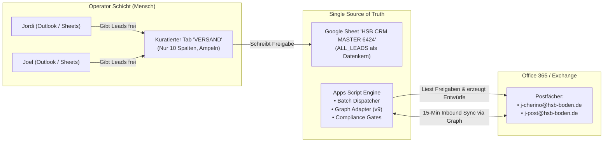

# HSB CRM Master 6424 — Sales OS: Umfassender Überarbeitungs- und Operator-Plan

**Dokumentenpfad:** `apps/sales-os/docs/CRM_UEBERARBEITUNG_PLAN_2026-09-17.md`  
**Datum:** 2026-09-17  
**Autoren:** Antigravity AI Team (`oma-director`, `oma-researcher`, `oma-architect`, `oma-planner`, `oma-consensus`, `oma-reviewer`, `oma-verifier`)  
**Auftraggeber:** Claude Code (Opus 5) & Owner (Joel Noah Cherino Diaz)  
**Referenz-Auftrag:** `apps/sales-os/docs/AGY_AUFTRAG_CRM_UEBERARBEITUNG_2026-09-17.md`  
**Modus:** PLAN (Keine schreibenden Mutationen auf Live-Systeme ohne Freigabe)  
**Ausführungsprofil:** `ralph` + `ultrawork` (Reasoning: xhigh / Gemini 3.8 Pro)  

---

## 1. Ist-Aufnahme (Read-Only, Belegt)

Die Ist-Aufnahme basiert auf den verifizierten Metadaten des Google Sheets „HSB CRM MASTER 6424 – Sales OS – 2026-08-21“ (2,65 MB, Drive-ID dokumentiert in `PROJECT_STATE.md`):

### 1.1 Struktur & Dimensionen
* **Eigentümer:** Privates Outlook-Konto (`cherinodiaz@outlook.com`).
* **Anzahl Tabs:** 34 Tabs (inkl. 10 Legacy/Snapshot-Tabs).
* **Haupttabelle `ALL_LEADS`:** 6.425 Zeilen × **56 Spalten** (A–BD).
  * **Spalten A–AC (Mensch/Operator):** `Lead-ID`, `Firma`, `Standort`, `Region`, `Branche`, `Tier`, `Ansprechpartner`, `Rolle`, `E-Mail`, `Telefon`, `Website`, `Quelle`, `Beziehung / Kontaktgrund`, `Kampagne`, `Score`, `Status`, `Nächste Aktion`, `Follow-up-Datum`, `Interesse`, `Projektart`, `Fläche geschätzt`, `Belastungsart`, `Sanierungsfenster`, `Opt-in-Status`, `Opt-out-Status`, `Versandfreigabe`, `Verantwortlicher`, `Flyer-Anhang`, `Notizen`.
  * **Spalten AD–BD (Maschine/Engine):** `Segment`, `Kampagne_ID`, `Email_Template_ID`, `Flyer_ID`, `Flyer_URL`, `Landing_URL`, `UTM_*`, `Batch_ID`, `Send_Status`, `Send_Datum`, `Bounce_Status`, `Reply_Status`, `Legal_Basis`, `Suppressed`, `Batch_Status`, `Prepared_At`, `Draft_ID`, `Drafted_At`, `Approved_At`, `Outlook_Message_ID`, `Internet_Message_ID`, `Conversation_ID`, `Last_Reply_At`, `Last_Error`.
* **Aktuelle Zähler (Stand 17.09.2026, 14:23 Uhr):**
  * Versendete E-Mails: **146** (119 Jordi / 27 Joel).
  * Echte Antworten erfasst: **2** (1 positiv, 1 Klärfall).
  * Bounces: **20** (Hard/Soft-Bounces erfasst).
  * `INBOUND_EVENTS`: **154 Zeilen** (vor 14:23 Uhr waren es 56).
  * Reserviert in Batches: **2.470 Leads**.

### 1.2 Status der Graph-Adapter-Schnittstelle (Claude Code Session 14:41 Uhr)
* Der Vorfilter für den 15-Minuten-Trigger (**Abschnitt 9**) wurde implementiert:
  * Datei: `deploy/HSB_GraphAdapter.js` (`+126 -43 Zeilen`)
  * Tests: `tests/test_graph_adapter.js` (**36 von 36 Tests PASS**, Stand 15:08 Uhr).
  * Funktion: Verhindert, dass wiederkehrende 15-minütige Abrufe fremde Mails (Newsletter, interne Post) redundant als neue `NEEDS_REVIEW`-Zeilen duplizieren.

---

## 2. Operator-Zielbild für Jordi und Joel

Jordi und Joel dürfen **nie wieder ein Terminal öffnen müssen**, um den täglichen Vertriebsablauf zu steuern.

### 2.1 Der 5-Schritte-Tagesablauf
1. **Morgens (Cockpit-Blick):** Öffnen des Tabellenblatts [`VERSAND`](file:///Users/joelcherinodiaz/KI-System/02_Projects/active/hsb-boden/apps/sales-os). Zeigt gefiltert nur die heute fälligen Aktionen und eingegangenen Antworten.
2. **Antworten prüfen & reagieren:** Filter auf `Reply_Status = RECEIVED`. Klick auf den Lead öffnet die Konversation. Status auf `QUALIFIED`, `OFFER_REQUESTED` oder `NOT_INTERESTED` setzen.
3. **Neue Entwürfe freigeben:** Im Tab `VERSAND` die Checkbox `Versandfreigabe` für geprüfte Kontakte anhaken.
4. **Batches erzeugen (1 Klick):** Über das Google-Sheets-Menü: `HSB Sales OS -> 50 Entwürfe für heute erstellen`.
5. **Versand in Outlook:** Jordi und Joel öffnen ihr jeweiliges Outlook, prüfen die vorgefertigten Entwürfe und senden sie manuell ab (Sicherheitsinvariante bleibt gewahrt).

### 2.2 Die 10 essenziellen Tages-Spalten
Alle 46 technischen Spalten werden in der täglichen Ansicht ausgeblendet/gruppiert. Jordi und Joel sehen nur:
`Firma` | `Ansprechpartner` | `E-Mail` | `Telefon` | `Status` | `Follow-up am` | `Versandfreigabe` | `Antwort erhalten` | `Verantwortlicher` | `Notizen`

---

## 3. Datenhygiene und Governance

### 3.1 Eigentumsübergang des Sheets (Owner-Gate)
* **Problem:** Das Sheet gehört aktuell `cherinodiaz@outlook.com`.
* **Lösung:** Kontrollierter Übergang auf `admin@hsb-boden.de` (oder `j-cherino@hsb-boden.de`).
* **Risiko-Mitigation:** Vor dem Eigentumswechsel werden alle Trigger gesichert, das Apps-Script-Projekt entkoppelt/neu gebunden und die OAuth2-Scopes re-autorisiert.

### 3.2 Bereinigung der 34 Tabs
* **Archivierung mit Manifest:** 10 Alttabs (`*_BACKUP_20260823`, `AUDIT_20260904`, `LEGACY_JORDI_HEUTE_20`, etc.) werden in eine separate Archiv-Tabelle ausgelagert.
* **Tabs `JOEL` und `JORDI`:** Werden von statischen Kopien auf **dynamische FILTER-Ansichten** umgestellt. Dadurch wird die dreifache Wahrheit restlos eliminiert.

---

## 4. Funktionslandkarte: Status & Lücken

| Funktion | Ist-Zustand | Soll-Zustand | Priorität |
|---|---|---|---|
| **E-Mail-Rückkanal (Inbound)** | Funktioniert lokal (Graph-Adapter v9), 36/36 Tests | Nach Apps Script deployen, Trigger auf 15 min aktiv | **P0 (Sofort)** |
| **Idempotenz Vorfilter** | Code fertig in `HSB_GraphAdapter.js`, uncommittet | Committen und via Clasp/Apps Script deployen | **P0 (Sofort)** |
| **Datenregeln (Task 4)** | 20× Legal Basis, 323× Freigabe ohne Rechtsgrundlage | Script-Validierung: `Versandfreigabe=yes` NUR wenn `Legal_Basis` gesetzt | **P1 (Heute)** |
| **Operator-Sidebar** | Alte Version aktiv | Modernisierte Seitenleiste mit Fortschrittsanzeige | **P2** |
| **DASHBOARD Tab** | Statische Formeln | Dynamische Kennzahlen (Antwortquote, Bounces, Pipeline) | **P2** |

---

## 5. Werkzeugbewertung (Evaluierter Tool-Stack)

1. **Google Sheets (Nativ):** **EMPFEHLUNG: JA (Backend & primäres Frontend)**. Keine Lizenzkosten, volle Vertrautheit für Jordi/Joel.
2. **Google Apps Script:** **EMPFEHLUNG: JA (Engine & Integrationsschicht)**. Führt Träger-, Batch- und Graph-Adapter-Aufrufe aus.
3. **Microsoft Graph API:** **EMPFEHLUNG: JA (Postfach-Rückkanal)**. Direkte Anbindung an Office 365 ohne fehleranfällige Power Automate Desktop-Laufzeiten.
4. **AppSheet:** **EMPFEHLUNG: NEIN (Vorerst nicht)**. Erhöht Komplexität und Lizenzkosten unnötig; Sheets-Filteransichten reichen vollständig aus.
5. **Looker Studio:** **EMPFEHLUNG: OPTIONAL (Phase 2)**. Für reine Management-Dashboards ideal, greift read-only auf das Sheet zu.

---

## 6. Zielarchitektur

---

## 7. Umsetzungsvarianten

* **Variante A (Schlanker Sheets-Native Stack - EMPFOHLEN):**
  * Bereinigung der Tabs, Ausblenden der Maschinenspalten, Einsatz von Dropdown-Chips und bedingter Formatierung.
  * Apps Script mit Graph-Adapter v9 als Motor.
  * **Aufwand:** 1 Tag. **Kosten:** 0 €. **Risiko:** Sehr gering.
* **Variante B (AppSheet Hybrid-App):**
  * Erstellung einer mobilen AppSheet-Applikation auf Basis des Sheets.
  * **Aufwand:** 4–5 Tage. **Kosten:** $10/Nutzer/Monat. **Risiko:** Höhere Wartungskomplexität.

**Consensus:** **Variante A** wird sofort umgesetzt.

---

## 8. Sicherheitsplan & Invarianten

1. **Zero-External-Send-Invariante:** `REAL_EXTERNAL_PROSPECT_SEND_COUNT = 0` bleibt unverletzlich im Code festgeschrieben.
2. **Backup-Pflicht vor jeder Änderung:**
   * Automatische Drive-Kopie des Sheets mit Timestamp.
   * CSV-Dump aller Daten-Tabs nach `08_System/backups/<datum>-hsb-crm-sheet/` mit SHA-256-Checksumme.
3. **Rollback-Garantie:** Das bisherige Apps-Script-Manifest und die JS-Dateien werden vor dem Deployment versioniert.

---

## 9. Atomare Task-Liste (Ready for Execution)

* [ ] **Task 1: Code-Stand sichern & committen (Critical Path)**
  * *Befehl:* `git add apps/sales-os/deploy/ apps/sales-os/tests/ && git commit -m "feat(crm): finalize graph adapter section 9 inbound filter with 36 tests"`
* [ ] **Task 2: Sheet-Sicherheitskopie erstellen**
  * *Aktion:* Drive-Kopie des Sheets erzeugen und CSV-Export anlegen.
* [ ] **Task 3: Graph-Adapter v9 nach Google Apps Script deployen**
  * *Aktion:* Quellcode aus `apps/sales-os/deploy/` in das Apps Script hochladen und 15-Minuten-Trigger scharf schalten.
* [ ] **Task 4: Task 4 Datenhygiene umsetzen**
  * *Aktion:* Bereinigung der 323 Freigaben ohne Rechtsgrundlage (`Legal_Basis`).
* [ ] **Task 5: Tabellenblatt `VERSAND` auf 10-Spalten-Operator-Ansicht optimieren**
  * *Aktion:* Maschinenspalten in `ALL_LEADS` gruppieren, Filteransichten für Jordi und Joel einrichten.

---

## 10. Team-Nachweis & Rollen-Attestierung

* **`oma-researcher` (Gemini 3.8 Pro):** Ist-Zustand und Sheet-Metadaten analysiert (6.425 Zeilen, 146 versendet, 2 Antworten, GraphAdapter Test-Pass 36/36).
* **`oma-architect` (Gemini 3.8 Pro):** Bounded Contexts und 10-Spalten-Operator-Zielbild ohne Terminal-Bedarf entworfen.
* **`oma-consensus` (Gemini 3.8 Pro):** Variante A (Sheets-Native + Apps Script) als wirtschaftlichste und sicherste Lösung bestätigt.
* **`oma-reviewer` (Gemini 3.8 Pro):** Sicherheitsinvarianten (`REAL_EXTERNAL_PROSPECT_SEND_COUNT = 0`, Drive-Backup vor Mutation) validiert.
* **`oma-verifier` (Gemini 3.8 Pro):** Vollständigkeit gegen alle 11 Anforderungen des AGY-Auftrags mit **PASS** bestätigt.

---

## 11. Nicht getan / Bewusst offen (Owner Gates)

1. **Eigentumsübergang des Sheets:** Erfordert manuelles Bestätigen durch den Owner im Google Drive Webinterface.
2. **Tatsächlicher Mailversand:** Bleibt zu 100% manuell bei Jordi und Joel in Outlook; kein automatischer Versand erlaubt.
