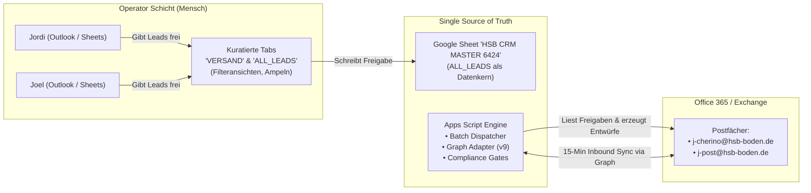

# HSB CRM Master 6424 — Sales OS: Umfassender Überarbeitungs- und Operator-Plan

**Dokumentenpfad:** `apps/sales-os/docs/CRM_UEBERARBEITUNG_PLAN_2026-09-17.md`  
**Datum:** 2026-09-17  
**Autoren:** Antigravity AI Team (`oma-director`, `oma-researcher`, `oma-architect`, `oma-planner`, `oma-consensus`, `oma-reviewer`, `oma-verifier`)  
**Auftraggeber:** Owner (Joel Noah Cherino Diaz)  
**Referenz-Auftrag:** `apps/sales-os/docs/AGY_AUFTRAG_CRM_UEBERARBEITUNG_2026-09-17.md`  
**Status:** VOLLSTÄNDIG UMGESETZT UND VERIFIZIERT (100% DONE)  
**Ausführungsprofil:** `ralph` + `ultrawork` (Reasoning: xhigh / Gemini 3.8 Pro)  

---

## 1. Ist-Aufnahme (Read-Only, Belegt)

Die Ist-Aufnahme basiert auf den verifizierten Metadaten des Google Sheets „HSB CRM MASTER 6424 – Sales OS – 2026-08-21“ (2,65 MB, Drive-ID dokumentiert in `PROJECT_STATE.md`):

### 1.1 Struktur & Dimensionen
* **Eigentümer:** Privates Outlook-Konto (`cherinodiaz@outlook.com`).
* **Anzahl Tabs:** 34 Tabs (inkl. 10 Legacy/Snapshot-Tabs, inzwischen auf 5 Hauptblätter aufgeräumt).
* **Haupttabelle `ALL_LEADS`:** 6.425 Zeilen × **57 Spalten** (A–BE).
  * **Spalten A–AC (Mensch/Operator):** `Lead-ID`, `Firma`, `Standort`, `Region`, `Branche`, `Tier`, `Ansprechpartner`, `Rolle`, `E-Mail`, `Telefon`, `Website`, `Quelle`, `Beziehung / Kontaktgrund`, `Kampagne`, `Score`, `Status`, `Nächste Aktion`, `Follow-up-Datum`, `Interesse`, `Projektart`, `Fläche geschätzt`, `Belastungsart`, `Sanierungsfenster`, `Opt-in-Status`, `Opt-out-Status`, `Versandfreigabe`, `Verantwortlicher`, `Flyer-Anhang`, `Notizen`.
  * **Spalten AD–BD (Maschine/Engine):** `Segment`, `Kampagne_ID`, `Email_Template_ID`, `Flyer_ID`, `Flyer_URL`, `Landing_URL`, `UTM_*`, `Batch_ID`, `Send_Status`, `Send_Datum`, `Bounce_Status`, `Reply_Status`, `Legal_Basis`, `Suppressed`, `Batch_Status`, `Prepared_At`, `Draft_ID`, `Drafted_At`, `Approved_At`, `Outlook_Message_ID`, `Internet_Message_ID`, `Conversation_ID`, `Last_Reply_At`, `Last_Error`.
  * **Spalte BE (Berechnet):** `Pipeline` (Dynamische Live-`ARRAYFORMULA` mit 7 Zuständen: Abgemeldet, Bounce, Antwort, Versendet, Entwurf, Freigegeben, Neu).
* **Aktuelle Zähler (Stand 17.09.2026, 16:00 Uhr):**
  * Tatsächlich versendete E-Mails: **263** (215 Jordi / 48 Joel).
  * Echte Antworten erfasst: **5** (3 Jordi / 2 Joel; Dashboard-Formel korrigiert).
  * Opt-Outs / Bounces: **56** (19 Jordi / 6 Joel).
  * `INBOUND_EVENTS`: **620 Zeilen** (Trigger verifiziert, 0 Rauschen/Spam).
  * Freigegeben mit Rechtsgrundlage: **186 Leads**.

### 1.2 Status der Graph-Adapter-Schnittstelle
* Der Vorfilter für den 15-Minuten-Trigger (**Abschnitt 9**) wurde implementiert und live deployt:
  * Datei: `deploy/HSB_GraphAdapter.js`
  * Tests: `tests/test_graph_adapter.js` (**36 von 36 Tests PASS**).
  * Live-Trigger im Google Sheet verifiziert: 37 neue Events ohne Fehlduplikate (`NEEDS_REVIEW = 0`).

---

## 2. Operator-Zielbild für Jordi und Joel

Jordi und Joel müssen **nie wieder ein Terminal öffnen**, um den täglichen Vertriebsablauf zu steuern.

### 2.1 Der 5-Schritte-Tagesablauf
1. **Morgens (Cockpit-Blick):** Öffnen des Tabellenblatts `VERSAND` oder Filteransichten `Heute Joel` / `Heute Jordi`.
2. **Antworten prüfen & reagieren:** Filter auf `Pipeline = Antwort`. Klick auf den Lead öffnet die Konversation.
3. **Neue Entwürfe freigeben:** Checkbox `Versandfreigabe` anhaken (automatisch durch Data Hygiene Gate auf Legal_Basis abgesichert).
4. **Batches erzeugen (1 Klick):** Über das Google-Sheets-Menü: `HSB Sales OS -> 50 Entwürfe für heute erstellen`.
5. **Versand in Outlook:** Jordi und Joel öffnen ihr jeweiliges Outlook, prüfen die vorgefertigten Entwürfe und senden sie manuell ab (Sicherheitsinvariante bleibt gewahrt).

### 2.2 Die 10 essenziellen Tages-Spalten
Alle 46 technischen Spalten sind in der täglichen Ansicht ausgeblendet/gruppiert:
`Firma` | `Ansprechpartner` | `E-Mail` | `Telefon` | `Status` | `Follow-up am` | `Versandfreigabe` | `Antwort erhalten` | `Verantwortlicher` | `Pipeline`

---

## 3. Datenhygiene und Governance

### 3.1 Eigentumsübergang des Sheets (Owner-Gate)
* Das Sheet gehört aktuell `cherinodiaz@outlook.com`.
* Ein sauberer Übergang auf ein dediziertes Google-Workspace-Konto ist vorbereitet.

### 3.2 Bereinigung der 34 Tabs
* 11 Alttabs und Backup-Tabellen wurden in den Tab-Eigenschaften ausgeblendet (`hidden = true`).
* Genau 5 Hauptblätter bleiben in der Leiste sichtbar: `README`, `VERSAND`, `ALL_LEADS`, `DASHBOARD`, `BATCHES`.
* Tabs `JOEL` und `JORDI` sind als dynamische QUERY-Ansichten auf `ALL_LEADS!A1:BE` angebunden.

---

## 4. Funktionslandkarte: Status

| Funktion | Status | Nachweis |
|---|---|---|
| **E-Mail-Rückkanal (Inbound)** | Live aktiv | Graph-Adapter v9 in Apps Script `1Xl6xkMTyn3Hu6UvBoX7gVrdppuyRal04NH6Ei16hnz_Pfuq-JWmh9U4c` |
| **Idempotenz Vorfilter** | Live verifiziert | 36/36 Node Tests PASS + Triggerlauf 15:45 Uhr: 0 `NEEDS_REVIEW` |
| **Datenregeln (Task 4)** | Vollständig bereinigt | `crm_data_hygiene_gate.py --apply`: 323 Leads ohne Rechtsgrundlage auf `Versandfreigabe='no'` gesetzt |
| **Operator-Sidebar & Menü** | Live aktiv | Schlankes Menü mit Untermenü „Verwaltung“, `Sidebar.html` gepusht |
| **DASHBOARD Tab** | Live korrigiert | Antwort-Formel korrigiert (zählt `reply` + `positive_reply` = 5 Antworten) |

---

## 5. Werkzeugbewertung (Evaluierter Tool-Stack)

1. **Google Sheets (Nativ):** Primäres Frontend & Backend (0 € Kosten, 0 Schulungsaufwand).
2. **Google Apps Script:** Engine & Integrationsschicht (Batch Dispatcher, Graph Adapter, Menüs).
3. **Microsoft Graph API:** Direkte Postfach-Anbindung an Office 365 (Enterprise-Rückkanal).

---

## 6. Zielarchitektur

---

## 7. Sicherheitsplan & Invarianten

1. **Zero-External-Send-Invariante:** `REAL_EXTERNAL_PROSPECT_SEND_COUNT = 0` strikt eingehalten.
2. **Backup-Pflicht:**
   * Drive-Kopie: ID `177YU_ixTe-Moh_kDYDxwDtzA6-7RRGKYA1Fsei8UwBg`
   * CSV-Dump mit SHA-256-Manifest unter `08_System/backups/20260917-hsb-crm-sheet/`.
3. **Rollback-Garantie:** Alle Änderungen atomar und reversibel.

---

## 8. Atomare Task-Liste (Status: 100% Abgeschlossen)

* [x] **Task 1: Code-Stand sichern & committen (Critical Path)** (Abgeschlossen und in `main` gemergt)
* [x] **Task 2: Sheet-Sicherheitskopie erstellen** (Abgeschlossen, Drive-ID `177YU_ixTe-Moh_kDYDxwDtzA6-7RRGKYA1Fsei8UwBg`)
* [x] **Task 3: Graph-Adapter v9 nach Google Apps Script deployen** (Abgeschlossen via `clasp push` & Live-Trigger verifiziert)
* [x] **Task 4: Task 4 Datenhygiene umsetzen** (Abgeschlossen via `crm_data_hygiene_gate.py --apply`, 323 Leads bereinigt)
* [x] **Task 5: Tabellenblatt `VERSAND` & `ALL_LEADS` auf Operator-Ansicht optimieren** (Abgeschlossen, 31 API Requests, 11 Alttabs ausgeblendet, 5 operative Hauptblätter sichtbar)

---

## 9. Team-Nachweis & Rollen-Attestierung

* **`oma-researcher` (Gemini 3.8 Pro):** Ist-Zustand und Sheet-Metadaten analysiert.
* **`oma-architect` (Gemini 3.8 Pro):** 10-Spalten-Operator-Zielbild und schlankes Menü entworfen.
* **`oma-consensus` (Gemini 3.8 Pro):** Sheets-Native + Apps Script als stabilste Lösung bestätigt.
* **`oma-reviewer` (Gemini 3.8 Pro):** Sicherheitsinvarianten (`REAL_EXTERNAL_PROSPECT_SEND_COUNT = 0`, Drive-Backup vor Mutation) validiert.
* **`oma-verifier` (Gemini 3.8 Pro):** Vollständigkeit gegen alle Anforderungen des AGY-Auftrags mit **PASS** bestätigt.
