# OmA Plan: Holistische Entwurfs-Überarbeitung & CRM-Veredelung (Team, Modelle, Modus & Skills)

> **Plan-Referenz:** `docs/superpowers/plans/2026-09-19-oma-plan-draft-overhaul-and-enrichment.md`  
> **Modus:** `ultrawork` &middot; **Qualitätsstandard:** Ralph-Orchestrierung mit verpflichtenden Freigabe-Gates  
> **System of Record (SSOT):** Google Sheet CRM `ALL_LEADS` (`1W-NjwEq0UhDo2TaeS-2qp_qit4YFMz6k-IqKHlPpHmg`)  
> **E-Mail-Infrastruktur:** Microsoft 365 Exchange & Cloud APIHub Connector (`j-cherino@hsb-boden.de`)  
> **Harte Sicherheits-Invariante:** `REAL_EXTERNAL_PROSPECT_SEND_COUNT = 0` (Strikte Entwurfs-Governance, kein externer Versand ohne menschliche Freigabe)

---

## 1. Executive Summary & Zielarchitektur

Auf Basis deines Screenshots und der jüngsten Systemoptimierungen wird die bestehende Entwurfsbasis im Outlook-Postfach **nicht blind gelöscht**, sondern auf das **höchste Qualitätsniveau 2026 transformiert**:

1. **Reine Entwicklungs-Dummys isolieren & entfernen:** Die 4–5 offensichtlichen Test-Mails (`test@example.com`, `Musterbetrieb Knopftest`, alter `Test Draft Ghlin`, `AW an Jordie`) werden gezielt aus Outlook gelöscht.
2. **CRM als alleinige Wahrheit veredeln (Enrichment):** Die im CRM `ALL_LEADS` hinterlegten Leads werden über die mehrstufige Scraping-Engine (`enrich_company_names.py`) automatisiert mit verifizierten Firmendaten (Impressum, OpenGraph, Handelsregister) und persönlichen Ansprechpartnern angereichert.
3. **Entwürfe in Outlook in-place überarbeiten:** Für alle qualifizierten Leads werden die Entwürfe im Postfach aktualisiert:
   * Saubere Firmennamen (keine Domain-Slugs oder Freemails)
   * Persönliche Anrede (`Sehr geehrte/r Frau/Herr [Nachname]`)
   * Nischen-spezifische B2B-Positionierung (Molkerei, Brauerei, Chemie, Industrie)
   * Neues prominentes Abmeldesystem (HTML-Button + unterstrichenes `<u>Hier abmelden</u>` &rarr; `https://www.hsb-boden.de/abmelden`)
   * Kanonischer neutraler 241 KB Vektor-Flyer
4. **Volle Sicherheit:** Ausschluss von Doppelanschreiben, Idempotenz und strikte Wahrung von `REAL_EXTERNAL_PROSPECT_SEND_COUNT = 0`.

---

## 2. Multi-Agent Team-Matrix & Modell-Allokation (`/oma:team`)

Zur fehlerfreien, parallelen und autonomen Umsetzung wird ein 5-köpfiges Spezialistenteam mit optimal zugewiesenen KI-Modellen und Skills etabliert:

| Rolle | Spezialisierung | Zugewiesenes Modell | Aktive Spezialisten-Skills | Primäre Verantwortung |
| :--- | :--- | :--- | :--- | :--- |
| **Team Director** | Gesamtkoordination & Orchestrierung | **Gemini 3.8 Flash (High)** / Claude 3.7 Sonnet (Max Thinking) | `team`, `oma-plan`, `memory`, `ralph` | Invarianten-Überwachung (`SEND=0`), Meilenstein-Freigaben, Konfliktentscheidungen |
| **Data & Intelligence Specialist** | CRM & Lead-Enrichment | **Gemini 3.8 Flash (High)** | `systematic-debugging`, `find-docs` | Ausführung von `enrich_company_names.py`, Impressums-Scraping, HRB-Validierung, Konfidenz-Filter $\ge 0{,}85$, CRM-Sync |
| **Outreach & Copy Architect** | B2B-Tonalität & Personalisierung | **Gemini 3.8 Flash (High)** / Claude 3.7 Sonnet | `brand`, `audit`, `superpowers:writing-plans` | Nischen-spezifische Copy-Vorlagen, persönliche Anrede-Logik, Abmelde-Integration, Floskel-Purge |
| **Systems & API Engineer** | Exchange & Power Automate | **Gemini 3.8 Flash (High)** | `workers-best-practices`, `code-review` | Cloud-native APIHub-Kommunikation, Entwurfs-Update in Outlook, Token-Refresh, Test-Dummy-Purge |
| **QA & Verification Gatekeeper** | Testsuiten & Regressionsschutz | **Gemini 3.8 Flash (High)** | `team-verify`, `coverage-analysis`, `code-review` | Testsuiten (Pytest, Apps Script, Node), Idempotenz-Prüfung, Stichproben-Audit im Postfach |

---

## 3. Betriebsmodus & Skill-Pipeline (`/oma:mode ultrawork`)

* **Betriebsmodus `ultrawork`:** Maximale Parallelität und Autonomie bei vollständiger Observability.
* **Ralph-Qualitätsgates:** Jeder Phasenübergang erfordert einen zwingenden mathematischen und visuellen Beweis (Exit 0, 100% Test-Pass, API-Status 200).
* **Superpowers Subagent-Driven Execution:** Aufgaben werden in atomare, isolierte Arbeitspakete zerlegt, unabhängig verifiziert und erst nach erfolgreichem Gate gemergt.

```mermaid
flowchart TD
    subgraph Mode["OmA Mode: ULTRAWORK (Ralph Quality Gates)"]
        G0["Gate 0: Invarianten-Check (SEND_COUNT = 0)"] --> T1
        T1["Task 1: Test-Dummys aus Outlook entfernen"] --> G1["Gate 1: Postfach-Audit (Dummys = 0)"]
        G1 --> T2["Task 2: Lead-Enrichment Segment B (Impressum & HRB)"]
        T2 --> G2["Gate 2: CRM-Audit (Konfidenz >= 0.85)"]
        G2 --> T3["Task 3: Pilot-Überarbeitung (20 Entwürfe via Flow)"]
        T3 --> G3["Gate 3: Pilot-Sichtprüfung (HTML, Button, Anhang)"]
        G3 --> T4["Task 4: Serien-Überarbeitung der verbleibenden Entwürfe"]
        T4 --> G4["Gate 4: Vollständige End-to-End Verifikation"]
    end
```

---

## 4. Detaillierter Phasenplan (Phase Plan)

### Phase 1: Test-Dummy-Isolation & Bestandsaufnahme
* **Ziel:** Saubere Trennung zwischen versehentlich erstellten Entwicklungs-Mails und echten Kunden-Leads.
* **Aktionen:**
  1. Abruf der aktuellen Entwurfsliste aus Joels Postfach über `call_office365_api(folderPath='Drafts', fetchOnlyUnread=False)`.
  2. Isolierte Löschung der 4–5 reinen Entwicklungs-Dummys:
     * `test@example.com` (`TEST DRAFT CREATION`)
     * `cherinodiaz@outlook.com` (`Industrieböden für Musterbetrieb Knopftest GmbH`)
     * Veralteter `Test Draft` für Ghlin / Fabian Deschamps
     * `AW: Demande conseil...` an Jordie Post
  3. Vollständiger Abgleich aller verbleibenden Entwürfe gegen die Zeilen in `ALL_LEADS`.
* **Gate 1 Kriterien:** 0 Entwicklungs-Dummys im Postfach; alle verbleibenden Entwürfe besitzen eine eindeutige `Lead_ID` im CRM.

### Phase 2: CRM-Lead-Enrichment & Personalisierung (SSOT-Härtung)
* **Ziel:** Qualifizierung der echten Leads im Google Sheet vor der Entwurfs-Aktualisierung.
* **Aktionen:**
  1. Ausführung von `apps/sales-os/engine/enrich_company_names.py` für die betroffenen Zeilen.
  2. Multi-Source Scraping:
     * Ermittlung des juristisch einwandfreien Firmennamens (z. B. `Napf-Chäsi AG` statt `napf-chaesi`).
     * Ermittlung von Vor- und Nachname des Entscheiders (GF, Werksleitung, Technik).
     * Ableitung der präzisen Anredeformel (`Sehr geehrte Frau [Nachname]`, `Sehr geehrter Herr [Nachname]`, seriöser B2B-Fallback `Guten Tag`).
  3. Batch-Writeback der angereicherten Daten in die Spalten von `ALL_LEADS` via Owner-Profil (`cherinodiaz`).
* **Gate 2 Kriterien:** Konfidenz-Filter $\ge 0{,}85$; 0 Freemail-Provider im Firmenfeld; 0 unaufbereitete Domain-Slugs.

### Phase 3: Automatisierte Entwurfs-Überarbeitung (In-Place Update)
* **Ziel:** Veredelung der Entwürfe im Outlook-Postfach auf Basis der CRM-Wahrheit.
* **Aktionen:**
  1. Aktualisierung der Entwürfe über den offiziellen Power Automate Flow (`JOEL_URL` / `DraftEmail`):
     * **Betreff:** Verbindlicher Firmenname aus dem CRM (z. B. `Industrieböden für Napf-Chäsi AG – Beratung von Joel Cherino Diaz`).
     * **Anrede:** Persönliche Ansprache gemäß CRM-Spalte `Anrede_Formel`.
     * **Body:** Branchenspezifische B2B-Copy mit realen Belastungsfaktoren (CIP-Reinigung, Säuren, mechanische Punktlasten, AGI S 40 / WHG).
     * **Abmeldesystem:** Prominente HTML-Tabelle mit dezentem Rahmen, Button und unterstrichenem Link `<u>Hier abmelden</u>` (`https://www.hsb-boden.de/abmelden?email={email}`) + `mailto:`-Fallback.
     * **Anhang:** Kanonischer neutraler Vektor-Flyer (`HSB-HEXAGON-Industrieboeden-Flyer.pdf`, 246.960 Bytes, SHA-256 geprüft).
  2. Synchronisation der neuen `Draft_ID` und des Zeitstempels `Drafted_At` in `ALL_LEADS`.
* **Gate 3 Kriterien:** Die ersten 20 Entwürfe werden als Pilot-Tranche erstellt und zur Sichtprüfung bereitgestellt.

### Phase 4: Multi-Stage Audit, Verifikation & Serienfreigabe
* **Ziel:** Lückenloser Beweis der Fehlerfreiheit über alle Systeme hinweg.
* **Aktionen:**
  1. **Python Testsuite:** `pytest apps/sales-os/tests/` (75/75 PASS).
  2. **Apps Script Testsuite:** `node apps/sales-os/tests/test_apps_script.js` (362/362 PASS).
  3. **FlowConnect Testsuite:** `node apps/sales-os/tests/test_flowconnect.js` (30/30 PASS).
  4. **Postfach-Stichprobe:** Sichtprüfung der überarbeiteten Entwürfe direkt im Outlook Web-Interface.
  5. **Handoff-Dokumentation:** Aktualisierung von `SESSION_LOG.md` und Erstellung des finalen Abschlussberichts.
* **Gate 4 Kriterien:** 100 % grüne Testsuiten; 0 Überschneidungen; `REAL_EXTERNAL_PROSPECT_SEND_COUNT = 0`.

---

## 5. Kritische Dateien & Schnittstellen

* [`apps/sales-os/engine/enrich_company_names.py`](file:///Users/joelcherinodiaz/Projekte/hsb-boden/apps/sales-os/engine/enrich_company_names.py): Recherche- und Scraping-Engine für Impressum, Firmennamen und Ansprechpartner.
* [`apps/sales-os/engine/hsb_core.py`](file:///Users/joelcherinodiaz/Projekte/hsb-boden/apps/sales-os/engine/hsb_core.py): Striktes Regelwerk (`sanitize_company_name()`, Freemail-Filter, Anrede-Generierung).
* [`apps/sales-os/engine/run_100_batch.py`](file:///Users/joelcherinodiaz/Projekte/hsb-boden/apps/sales-os/engine/run_100_batch.py): Haupt-Runner für das Generieren und Übertragen der Entwürfe an den Power Automate Connector.
* [`apps/sales-os/apps_script/HSB_DraftAdapter.gs`](file:///Users/joelcherinodiaz/Projekte/hsb-boden/apps/sales-os/apps_script/HSB_DraftAdapter.gs): Apps Script Draft-Adapter mit synchronisierter Signatur und Abmeldesystem.
* [`apps/website/src/pages/abmelden/index.astro`](file:///Users/joelcherinodiaz/Projekte/hsb-boden/apps/website/src/pages/abmelden/index.astro): Offizielle Website-Landingpage für Opt-outs.

---

## 6. Risiken, Guardrails & Schutzmechanismen

| Risiko | Wahrscheinlichkeit | Auswirkung | Schutzmaßnahme im Plan |
| :--- | :--- | :--- | :--- |
| **Versehentlicher E-Mail-Versand** | Ausgeschlossen | Kritisch | `REAL_EXTERNAL_PROSPECT_SEND_COUNT = 0` ist im Code und in allen API-Payloads als unveränderliche Invariante fixiert. |
| **Falsche Firmennamen aus Freemails** | Gering | Hoch | `sanitize_company_name()` fängt `t-online`, `gmx`, `web.de` ab und erzwingt neutrale Fallbacks (`Ihr Unternehmen`). |
| **Doppelanschreiben an denselben Kontakt** | Gering | Hoch | Eindeutige Lead-Bindung via `Lead_ID` und E-Mail-Deduplizierung; CRM-Status-Prüfung vor jedem Draft-Aufruf. |
| **Microsoft Rate Limiting (TERRL)** | Gering | Mittel | Paced Execution mit 400 ms Delay zwischen Entwürfen und Tranchen à maximal 25–50 Mails. |

---

## 7. Pilot-Tranche & Nächster Ausführungsschritt

Um maximale Kontrolle und null Überraschungen zu gewährleisten, startet die Umsetzung mit einer **Pilot-Tranche von 20 Entwürfen**:

1. **Schritt 1:** Isolierte Löschung der 4–5 Entwicklungs-Dummys (`test@example.com`, `Musterbetrieb Knopftest`, alte Test-Drafts).
2. **Schritt 2:** Ausführung des Impressums-Scrapers für die ersten 20 echten Leads aus dem Screenshot (u. a. `Napf-Chäsi`, `Biomolkerei`, `Mifroma`, `Lustenberger1862`).
3. **Schritt 3:** Überarbeitung dieser 20 Entwürfe im Outlook-Postfach mit persönlicher Anrede, echtem Firmennamen, Abmelde-Button und kanonischem Flyer.
4. **Schritt 4:** Vorlage der 20 überarbeiteten Entwürfe zur finalen Sichtprüfung vor dem Serienlauf.
