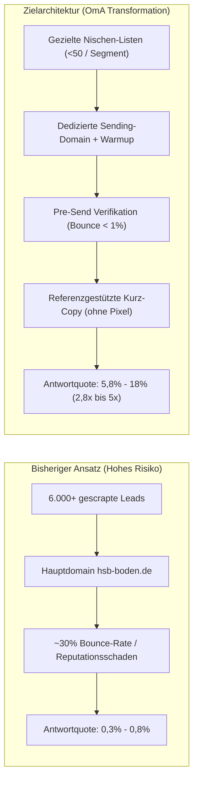

# OmA Plan: Strategische Neuausrichtung der B2B-Kaltakquise & Sending-Domain-Infrastruktur

> **Plan-Referenz:** `docs/superpowers/plans/2026-09-19-oma-plan-outbound-transformation.md`  
> **Status:** Genehmigt zur schrittweisen Umsetzung  
> **Grundlage:** Strategisches Gutachten (DE/CH) & Beschluss zur dedizierten Sending-Domain vom 18./19.09.2026  
> **Harte Guardrail:** Schutz der Haupt-Geschäftsdomain `hsb-boden.de` (Reputationsschutz: 100%)

---

## 1. Executive Summary & Zielsetzung

Die bisherige Kaltakquise-Infrastruktur wird von einem reinen Mengenansatz (Massenlisten > 6.000 Kontakte, generische Fallback-Anreden, Versand über Produktivpostfächer) auf eine **hochkonvertierende, rechtlich abgesicherte und technisch isolierte Qualitäts-Outreach-Architektur** umgestellt:



---

## 2. Phase 1: Technische Infrastruktur & Dedizierte Sending-Domain

### 1.1 Domain-Isolation & DNS-Konfiguration
- **Domain-Erwerb:** Registrierung einer gleichnamigen, branchenspezifischen Sending-Domain (z. B. `hsb-industrie-boden.de` oder `hsb-saeurebau.de`).
- **Schutz der Hauptdomain:** Sämtliche operativen Akquise-Mails laufen über die neue Domain. Die primäre Geschäftsdomain `hsb-boden.de` bleibt für Tageskorrespondenz, Angebote und Bestandskunden vollständig isoliert und vor Reputationseinbrüchen geschützt.
- **DNS-Hardening (Fail-Closed):**
  - **SPF (Sender Policy Framework):** `v=spf1 include:spf.protection.outlook.com -all` (striktes `-all`, kein Softfail `~all`).
  - **DKIM (DomainKeys Identified Mail):** 2048-Bit RSA-Key mit zwei rotierenden Selektoren (`selector1`, `selector2`).
  - **DMARC (Domain-based Message Authentication):**
    - Tag 1–14: `v=DMARC1; p=none; rua=mailto:dmarc-reports@hsb-boden.de; pct=100; sp=none; aspf=r; adkim=r` (Monitoring-Modus).
    - Ab Woche 3: Hochstufung auf `p=quarantine` und anschließend `p=reject`.
  - **Custom Tracking Domain:** Vollständiger Verzicht auf Tracking-Pixel und Link-Umleitungen (Verhinderung von URL-Blacklisting bei Microsoft/Google).

### 1.2 M365 TERRL-Compliance & Paced Warmup
- **Tenant-Schutz:** Microsofts TERRL (*Tenant-Level Exceeded Rate and Receiver Limits*) bestraft unkontrollierte Sendespitzen tenant-weit.
- **Warmup-Fahrplan (Dauer: 4 Wochen):**
  - **Woche 1:** 5 bis 10 Mails pro Postfach/Tag (nur qualifizierte, vorverifizierte Adressen mit echten Namen).
  - **Woche 2:** 15 bis 25 Mails pro Postfach/Tag (Steigerung max. +20 % pro Tag).
  - **Woche 3:** 30 bis 40 Mails pro Postfach/Tag.
  - **Woche 4 (Ceiling):** Festes Limit von **max. 35–50 Mails pro Postfach/Tag**.
- **Jitter & Delays:** Künstlicher Jitter von 45 bis 180 Sekunden zwischen Mails, kein Blockversand.

---

## 3. Phase 2: Listenhygiene, Verifikation & Daten-Bereinigung

### 2.1 Pre-Send Listenverifikation (ZeroBounce / NeverBounce)
- Keine E-Mail wird ohne vorherige SMTP-/MX-Handshake-Verifikation versendet.
- **Filter-Kriterien:**
  - `INVALID` &rarr; Sofortige permanente Löschung / Unterdrückung.
  - `CATCH-ALL` / `RISKY` &rarr; Ausschluss aus Erstkampagnen; Freigabe nur nach manueller Qualifikation.
  - `SPAMTRAP` / `DISPOSABLE` &rarr; Quarantäne.
- **Ziel-KPI:** Gesamt-Bounce-Rate dauerhaft **< 1,5 %** (Hardbounces **< 0,5 %**).

### 2.2 Bereinigung von Freemail- und Domain-Artefakten
- **Schutzregel:** Freemail-Provider (`t-online.de`, `gmx.net`, `web.de`, `gmail.com`, `yahoo.com`, `aol.com` etc.) dürfen niemals ungeprüft als Firmenname übernommen werden (`Industrieböden für T-Online` ist durch `sanitize_company_name()` im Code und Sheet permanent unterbunden).
- Leads mit Freemail-Adressen ohne verifizierten Firmennamen erhalten zwingend den Fallback `Ihr Unternehmen` oder werden manuell recherchiert.

---

## 4. Phase 3: Optimierung der Copy & Steigerung der Effektivität

### 4.1 Die 4 Hebel für maximale Antwortraten
1. **Listengröße unter 50 Kontakten pro Kampagne:**  
   Branchenanalysen (16,5 Mio. E-Mails) belegen: Kampagnen unter 50 Empfängern erzielen **5,8 % Reply Rate** vs. 2,1 % bei Massenlisten (500+).
2. **Reale Ansprechpartner statt Platzhalter:**  
   Recherche der tatsächlichen Betriebs-, Werks-, Instandhaltungs- oder Technik-Leiter.
3. **Referenzgestützte Problem-Lösung (Pain Points):**  
   Nennung realer Belastungsszenarien (aggressives CIP, Milchsäure, Fette, Heißwasser, Stapler-Poinçonnement) und belastbarer Referenzen (Südzucker Group, Meggle, Biovegan, Zahna-Fliesen).
4. **Kompaktheit & Respekt vor der Zeit des Empfängers:**  
   Maximal 3–4 kurze Absätze. Ein klarer, unverbindlicher Call-to-Action (technische Ersteinschätzung vor Ort).

---

## 5. Phase 4: Vorher / Nachher Copy-Templates

### 5.1 Bisheriger Standard-Text (Generisch)
> **Betreff:** Industrieböden für [Firma] – Beratung von Joel Cherino Diaz  
> *Schwächen:* Langer Fließtext, generische Aufzählung („Risse, Keimnester, falsches Gefälle“), keine branchenspezifischen Referenzen, wirkt wie Massenanschreiben.

### 5.2 Optimierte Nischen-Vorlagen (Ausgereift, referenzgestützt)

#### Vorlage A: Lebensmittel- & Getränkeproduktion / Molkereien
```text
Betreff: Säurebeständiger Boden für [Firma] – Nassbereich?

Sehr geehrte/r Frau/Herr [Nachname],

in Lebensmittel- und Abfüllbetrieben scheitern Industrieböden meist an denselben Faktoren: aggressive Heißwasser- und CIP-Reinigung, organische Säuren und ständiger Flurförderverkehr öffnen Fugen und schaffen Keimnester in Nassbereichen.

Als Spezialbauunternehmen planen und sanieren wir säurefeste, fugenarme Keramik- und Reaktionsharzböden exakt nach dem realen Lastprofil – unter anderem für Betriebe der Südzucker Group, Meggle und Biovegan. Sanierungen führen wir auf Wunsch in kurzen Zeitfenstern oder im laufenden Betrieb aus.

Wäre eine kurze, unverbindliche Ersteinschätzung Ihres Belastungsprofils vor Ort für [Firma] von Interesse?

Mit freundlichen Grüßen
Joel Cherino Diaz
HSB Hexagon Säurebau GmbH
[Vollständiges Impressum & Abmelde-Hinweis]
```

#### Vorlage B: Chemie-, Pharma- & Prozessindustrie
```text
Betreff: [Firma]: Chemikalienresistente Bodensysteme nach WHG?

Sehr geehrte/r Frau/Herr [Nachname],

beim Umgang mit aggressiven Medien, Lösemitteln und thermischen Wechsellasten stoßen Standard-Beschichtungen schnell an ihre Grenzen – Risse, Unterwanderungen und mangelnde Dichtigkeit sind die Folge.

HSB Hexagon Säurebau realisiert WHG-konforme, hochresistente Säurebau- und Keramikböden für produktionskritische Bereiche. Von der Bestandsanalyse bis zur rissüberbrückenden Systemausführung stimmen wir Schichtaufbau und Fugenwerkstoffe exakt auf Ihre Medienliste ab.

Können wir Ihnen bei anstehenden Instandhaltungen oder Umbauten bei [Firma] mit Richtwerten oder einem technischen Vor-Ort-Check behilflich sein?

Mit freundlichen Grüßen
Jordie Post
HSB Hexagon Säurebau GmbH
[Vollständiges Impressum & Abmelde-Hinweis]
```

---

## 6. Risikomatrix & Prüfpunkte (Checkpoints)

| Checkpoint | Prüfung / Metrik | Grenzwert / Abbruchkriterium | Aktion bei Abweichung |
|---|---|---|---|
| **CP-1: Domain Setup** | SPF, DKIM (2048), DMARC | 100% syntaktisch valide | Kein Versand vor Validierung |
| **CP-2: List Hygiene** | Bounce-Rate Verifikation | Vorhersage Hardbounce > 1% | Adressen ausfiltern / Quarantäne |
| **CP-3: Warmup Limit** | Postfach-Tagesvolumen | Max. 10 (W1) &rarr; 25 (W2) &rarr; 40 (W3) | Paced Dispatcher drosselt automatisch |
| **CP-4: Spam Complaints** | Google Postmaster / SNDS | Beschwerderate > 0,1 % (max. 0,3%) | Sofortiger Versand-Stopp für 14 Tage |
| **CP-5: Lead Data Sanity** | `sanitize_company_name()` | Keine Freemail-Namen im Betreff | Fail-closed Fallback: `Ihr Unternehmen` |
