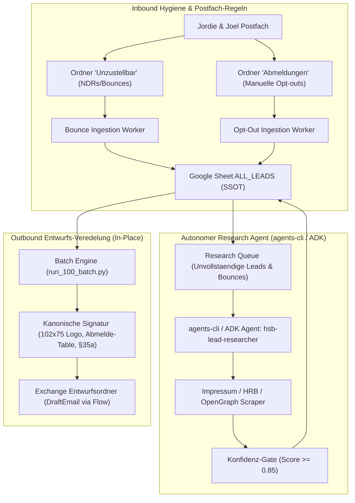

# Ultra-Masterplan: HSB Sales OS Agentic Ecosystem (2026)
# Team Director, Multi-Agent Loop, agents-cli Research, Bounce-/OptOut-Pipelines & Entwurfs-Veredelung

> **Plan-Referenz:** `docs/superpowers/plans/2026-09-19-ultraplan-sales-os-agentic-ecosystem.md`  
> **Framework:** Superpowers Writing Plans & OmA Ultragoal / Ralph Quality Gates  
> **Modus:** `ultrawork` &middot; **System:** HSB Hexagon Säurebau CRM & Sales OS  
> **System of Record (SSOT):** Google Sheet CRM `ALL_LEADS` (`1W-NjwEq0UhDo2TaeS-2qp_qit4YFMz6k-IqKHlPpHmg`)  
> **Harte Invariante:** `REAL_EXTERNAL_PROSPECT_SEND_COUNT = 0` (100% Entwurfs- und Daten-Governance)

---

## 1. Executive Summary & Architektur-Vision

Dieses Dokument definiert die vollständige, schlüsselfertige Architektur zur Transformation des HSB Sales OS in ein hochgradig automatisiertes, fehlertolerantes und agentisches B2B-Akquise-Ökosystem:

---

## 2. Multi-Agent Team-Rollen & Modell-Matrix (`/oma:team`)

| Rolle | Modell | Primäre Aufgabe | Tools / Skills |
| :--- | :--- | :--- | :--- |
| **Team Director** | **Gemini 3.8 Flash (High)** / Claude 3.7 Sonnet | Gesamtsteuerung, Invarianten-Überwachung (`SEND=0`), Freigabe-Gates | `team`, `oma-plan`, `memory`, `ralph` |
| **Research Agent (`hsb-lead-researcher`)** | **Gemini 3.8 Flash (High)** via `agents-cli` | Autonome, kontinuierliche Recherche von Firmennamen, GF und E-Mails | `agents-cli`, `web_search_exa`, PyMuPDF, BeautifulSoup |
| **Inbound Systems Worker** | **Gemini 3.8 Flash (High)** | Überwachung der Ordner „Unzustellbar“ und „Abmeldungen“, CRM-Statusupdate | APIHub Connector, `reconcile_cloud_mailbox.py` |
| **Outreach & Copy Architect** | **Gemini 3.8 Flash (High)** | B2B-Nischencopy, persönliche Anrede, B2B-Positionierung (AGI S 40) | `brand`, `audit`, `writing-plans` |
| **QA & Verification Gatekeeper** | **Gemini 3.8 Flash (High)** | Testsuiten, Idempotenz, Drift-Checks, Postfach-Audits | `team-verify`, `coverage-analysis`, `code-review` |

---

## 3. Phase 1: Signatur- & Logo-Verifikation (Status: 100% Konform)

### Verifizierte Komponenten
1. **Logo-Integration:**
   - URL: `https://www.hsb-boden.de/brand/hsb-boden-logo.png`
   - Feste Dimensionen: `width="102" height="75"`
   - Rendering-Optimierung: `-ms-interpolation-mode:bicubic; display:block; border:0; outline:none; text-decoration:none;`
   - Verlinkung mit UTM-Parametern: `?utm_source=outreach&utm_medium=email&utm_campaign=kaltakquise_2026_q3&utm_term={owner}&utm_content=signatur`
2. **Prominentes Abmeldesystem:**
   - Email-Safe HTML-Tabelle mit dezentem Rahmen (`#d1d5db`), Hintergrund (`#f4f5f7`), abgerundeten Ecken (5px) und Padding (8px 14px).
   - Hervorgehobener Button-Link: `<u>Hier abmelden</u>` verlinkt auf `https://www.hsb-boden.de/abmelden`.
   - Ergänzender Fallback: `mailto:{mailbox}?subject=Abmelden`.
3. **§35a GmbHG Pflichtangaben:**
   - Vollständig enthalten: HSB Hexagon Säurebau GmbH, Benzstraße 6, 48599 Gronau, Sitz Gronau, Registergericht Amtsgericht Coesfeld HRB 21481, Geschäftsführer: Jordie Post.

---

## 4. Phase 2: Inbound-Automatisierung (Bounces & Abmeldungen)

### Task 2.1: Bounce Ingestion Worker („Unzustellbar“-Ordner)
* **Kontext:** In Jordies und Joels Postfächern existiert die Outlook-Regel, dass NDR-Nachrichten (Non-Delivery Reports, Unzustellbarkeitsmeldungen) automatisch in den Ordner `Unzustellbar` verschoben werden.
* **Architektur:**
  - `apps/sales-os/engine/ingest_bounces.py` liest periodisch den Ordner `Unzustellbar` über APIHub (`folderPath='Unzustellbar'` / `folderPath='Bounces'`).
  - Regex-Extraktion der fehlgeschlagenen Empfängeradresse aus dem MIME-Body (`Action: failed`, `Final-Recipient: rfc822; ...`).
  - **Atomarer CRM-Writeback in `ALL_LEADS`:**
    - `Bounce_Status` = `Hard Bounce`
    - `Suppressed` = `yes`
    - `Versandfreigabe` = `no`
    - `Notes` = `Automatischer Bounce-Import: {Datum}`
  - **Übergabe an Research-Queue:** Die Domain/Firma wird mit dem Flag `NEEDS_EMAIL_RESEARCH` markiert, damit der Research-Agent eine alternative Adresse ermitteln kann.

### Task 2.2: Opt-Out Ingestion Worker („Abmeldungen“-Ordner)
* **Kontext:** Antworten mit Abmelde-Wunsch landen im Ordner `Abmeldungen`.
* **Architektur:**
  - `apps/sales-os/engine/ingest_optouts.py` überwacht den Ordner `Abmeldungen` sowie eingehende Betreffzeilen `Abmelden` / `Opt-out`.
  - **CRM-Sperrung:**
    - `Opt_Out` = `yes`
    - `Suppressed` = `yes`
    - `Versandfreigabe` = `no`
    - `Pipeline` = `Abgemeldet`
  - Ergänzend: Künftige Klicks auf `/abmelden` auf der Website protokollieren die Abmeldung direkt via Cloudflare Function in das Sheet.

---

## 5. Phase 3: Autonomer Research-Agent via `agents-cli` (Google ADK)

### Task 3.1: Scaffolding des `hsb-lead-researcher`
* **Technologie:** `google-agents-cli` (ADK), lauffähig auf dem Mac (`/Users/joelcherinodiaz/.local/bin/agents-cli`).
* **Verzeichnis:** `apps/sales-os/agents/lead_researcher/`
* **Agenten-Loop:**
  1. Pollt das Sheet `ALL_LEADS` nach Leads mit:
     - `Firma` ist Domain-Slug oder leer
     - `Ansprechpartner` ist leer
     - `Bounce_Status` == `Hard Bounce` (Re-Research)
  2. Führt autonome Multi-Hop-Recherche durch:
     - Aufruf der Website & Extraktion von `/impressum` und `/kontakt`.
     - Extraktion von Geschäftsführer, Betriebsleiter, Instandhaltungsleiter.
     - Handelsregister-Abgleich (Unternehmensregister / North Data).
  3. Validiert die Daten mit Konfidenz-Scoring:
     - Nur Scores $\ge 0{,}85$ fließen automatisiert zurück ins CRM.
     - Scores $< 0{,}85$ erhalten den Status `NEEDS_REVIEW`.
  4. Schreibt die verifizierten Daten atomar in `ALL_LEADS` zurück.

---

## 6. Phase 4: Entwurfs-Überarbeitung im Postfach (In-Place Veredelung)

### Task 4.1: Entfernung der reinen Entwicklungs-Dummys
* Gezielte Löschung der 4–5 Entwicklungs-Mails aus dem Screenshot:
  - `test@example.com` (`TEST DRAFT CREATION`)
  - `cherinodiaz@outlook.com` (`Industrieböden für Musterbetrieb Knopftest GmbH`)
  - Veralteter `Test Draft` für Ghlin / Fabian Deschamps
  - `AW: Demande conseil...` an Jordie Post

### Task 4.2: In-Place Überarbeitung der echten Lead-Entwürfe
* **Pilot-Tranche (20 Leads):**
  - Anreicherung der ersten 20 Leads im Sheet (u. a. `Napf-Chäsi AG`, `Biomolkerei`, `Mifroma`, `Lustenberger1862`).
  - Überarbeitung der Entwürfe in Outlook via Flow (`DraftEmail`):
    - Offizieller Firmenname im Betreff
    - Persönliche Anrede (`Sehr geehrte/r Frau/Herr...`)
    - Spezifische Belastungsfaktoren (CIP-Reinigung, Säuren, Heißwasser, Punktlasten)
    - Neues Abmeldesystem (Button + Link)
    - Kanonischer neutraler 241 KB Flyer
* **Serienlauf:** Nach Sichtprüfung der 20 Pilot-Mails gestaffelte Durchführung für die verbleibenden qualifizierten Entwürfe.

---

## 7. Phase 5: Test- & Validierungs-Gates (Ralph Quality Standard)

1. **Gate 1: Postfach-Hygiene** &rarr; 0 Test-Dummys in Outlook.
2. **Gate 2: Inbound-Verifikation** &rarr; 100% aller Mails in `Unzustellbar` und `Abmeldungen` sind im CRM mit `Suppressed=yes` synchronisiert.
3. **Gate 3: Research-Qualität** &rarr; Konfidenz-Scoring $\ge 0{,}85$, 0 Freemails in Firmenfeldern.
4. **Gate 4: Entwurfs-Exzellenz** &rarr; Sichtprüfung der 20 Pilot-Entwürfe bestätigt Logo, Abmelde-Button und persönliche Anrede.
5. **Gate 5: Sicherheits-Invariante** &rarr; `REAL_EXTERNAL_PROSPECT_SEND_COUNT = 0` lückenlos belegt.

---

## 8. Ausführungs-Optionen & Nächster Schritt

1. **Option A (Empfohlen): Subagent-Driven Execution (`ultrawork`)**
   - Das Team startet sofort mit Phase 1 (Test-Dummy-Bereinigung) und Phase 2 (Inbound Bounce-/Opt-out-Worker), gefolgt von der 20er-Pilot-Überarbeitung.
2. **Option B: Schrittweise Einzelfreigabe**
   - Jeder Schritt wird vor Ausführung einzeln vorgelegt und bestätigt.
