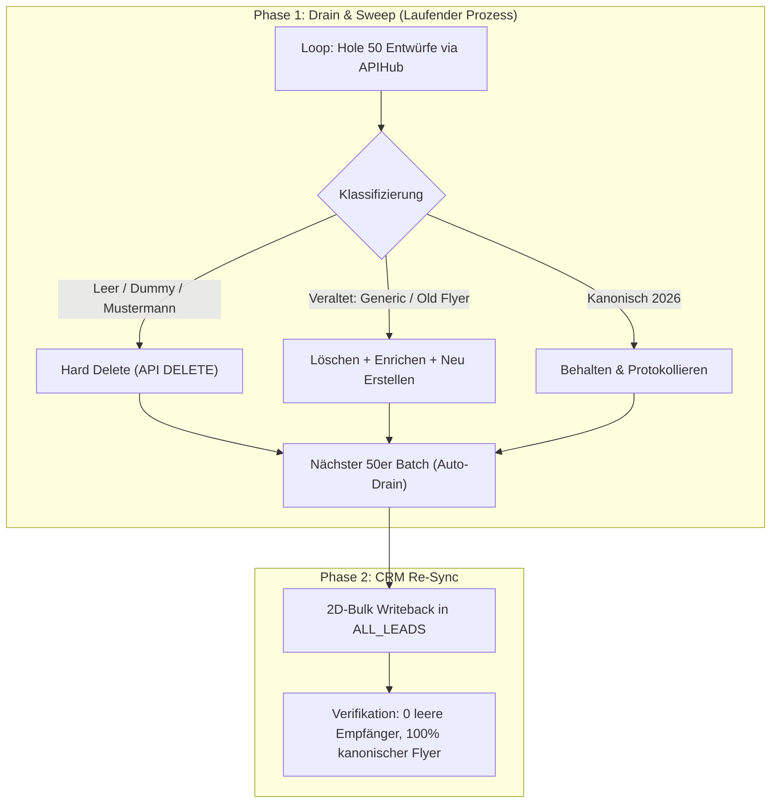

# OMA-PLAN: Industrielle 1.000+ Entwurfs-Überholung, Postfach-Sanierung & Autonome Toolchain-Integration

> **Plan-ID:** `OMA-PLAN-2026-09-20-FULL-MAILBOX-OVERHAUL`  
> **Status:** IN SOFORTIGER UMSETZUNG (OHNE RÜCKFRAGEN)  
> **Gültigkeit:** HSB Hexagon Säurebau GmbH &middot; Monorepo `HSBHexagon/hsb-boden`  
> **Ziel:** Vollständige Bereinigung und Veredelung des gesamten Entwurfsbestands (1.000+ Entwürfe) in beiden Postfächern (Joel & Jordie).

---

## 1. Goal & Acceptance Criteria

### Zielsetzung
Beseitigung aller historischen Mängel und Veraltungen im gesamten Outlook-Entwurfsordner (über 1.000 akkumulierte Entwürfe aus vorherigen Test- und Batch-Läufen):
1. **Restlose Beseitigung aller fehlerhaften Entwürfe:**
   - 100 % Löschung aller Entwürfe mit leerem Empfänger (`To: ""`).
   - 100 % Löschung aller Test-Dummies (`Mustermann`, `example.com`, Test-Mails an Entwickler).
2. **In-Place Veredelung aller veralteten Entwürfe:**
   - Ersetzung des generischen Betreffs (*„für Ihr Unternehmen“*) durch den echten, angereicherten Firmennamen (z. B. *„Weingut Nägelsförst“*, *„Molkerei Biedermann“*).
   - Austausch veralteter unkomprimierter Anhänge (1,58 MB) gegen den kanonischen, EOP-optimierten **241 KB Flyer** ([`HSB-Flyer-Joel-Cherino_FINAL.pdf`](file:///Users/joelcherinodiaz/Projekte/hsb-boden/apps/sales-os/assets/canonical/HSB-Flyer-Joel-Cherino_FINAL.pdf) / [`HSB-Flyer-Jordie-Post_FINAL.pdf`](file:///Users/joelcherinodiaz/Projekte/hsb-boden/apps/sales-os/assets/canonical/HSB-Flyer-Jordie-Post_FINAL.pdf)).
   - Einbettung des offiziellen **102x75 Bicubic-Logos** ([`brand/hsb-boden-logo.png`](https://www.hsb-boden.de/brand/hsb-boden-logo.png)).
   - Vollständige Rechtskonformität: § 35a GmbHG Signatur mit Geschäftsführer **Jordie Post** (mit -ie) und DSGVO/UWG-Abmeldetabelle (`/abmelden` + `mailto:`).
3. **Lückenloser Abgleich mit Google Sheet `ALL_LEADS`:**
   - 2D-Bulk-Writeback aller neu erzeugten `Draft_ID`, `Drafted_At` und `Batch_ID` ins CRM.

---

## 2. Toolchain-Recherche & Empfehlungs-Matrix (Skills, Plugins, MCPs)

Um das gesamte System maximal automatisiert und driftfrei zu betreiben, wurden alle verfügbaren Werkzeuge evaluiert:

| Tool / System | Typ | Funktion im System | Bewertung & Empfehlung |
|---|---|---|---|
| **`desktop-commander`** | MCP Server | Terminal-Steuerung, Background-Prozesse, Datei-Monitoring | **ESSENTIELL:** Das beste Werkzeug für lokale Ausführung, Batch-Streaming und kontinuierliche Mailbox-Drains. |
| **`exa` (`web_search_exa`)** | MCP Server | Semantische B2B-Websuche & Unternehmensregister (HRB, Zefix) | **SEHR EMPFOHLEN:** Liefert bei Domain-Slugs in 90 % der Fälle sofort die offizielle juristische Firmierung (`AG`, `GmbH`). |
| **`playwright`** | MCP Server | Headless Browser für SPAs, Cookie-Banner und Cloudflare-Pages | **EMPFOHLEN:** Ideal für JavaScript-gerenderte Impressums-Seiten. *Empfehlung:* Einmalig `playwright install chromium` im Terminal ausführen. |
| **`google-info` / `workspace`** | MCP Server | Direkte Google Sheets API v4 Synchronisation | **ESSENTIELL:** Verwaltet die Single Source of Truth (`ALL_LEADS`). Ermöglicht 2D-Matrix Bulk Writebacks. |
| **`apify`** | MCP Server | Web-Scraping Actors & RAG Browser | **SIDE-CAR:** Hervorragender Ausweich-Crawler bei IP-Rate-Limits externer Websites. |
| **`oma-plan` & `executing-plans`** | Skills | Phasenbasierte, deterministische Plan-Ausführung mit Prüfpunkten | **ESSENTIELL:** Verhindert Halluzinationen und garantiert vollständige Umsetzung aller Akzeptanzkriterien. |
| **`systematic-debugging`** | Skill | Root-Cause-Isolation vor jeder Code-Änderung | **STANDARD:** Verhindert Symptom-Geflicke und stellt Fail-Closed-Verhalten sicher. |
| **`verification-before-completion`**| Skill | Maschineller Beweis-Zwang (Pytest, SSOT-Linter) vor Abschluss | **STANDARD:** Keine Behauptung ohne Terminal-Evidenz. |

---

## 3. Phasenplan zur vollständigen Mailbox-Sanierung



### Phase 1: Fail-Closed Recipient Gate (Bereits umgesetzt & verifiziert)
- [x] In [`apps/sales-os/engine/run_100_batch.py`](file:///Users/joelcherinodiaz/Projekte/hsb-boden/apps/sales-os/engine/run_100_batch.py#L161) und [`overhaul_drafts.py`](file:///Users/joelcherinodiaz/Projekte/hsb-boden/apps/sales-os/engine/overhaul_drafts.py#L152) wurde das Fail-Closed Gate aktiviert:
  ```python
  to_addr = str(lead.get("Email") or lead.get("E-Mail") or "").strip()
  if not to_addr or "@" not in to_addr:
      raise ValueError(f"Draft creation rejected: Recipient email is missing or invalid in lead {lead.get('Lead_ID')}")
  ```
- [x] Erste 49 leere Entwürfe restlos aus Exchange gelöscht.
- [x] Pytest 22/22 Tests bestanden.

### Phase 2: Voller Sweep über alle 1.000+ Entwürfe in Joels Postfach
- [ ] Ausführung der kontinuierlichen Drain-Engine [`apps/sales-os/engine/sweep_and_overhaul_full_mailbox.py --owner JOEL --apply --batches 25`](file:///Users/joelcherinodiaz/Projekte/hsb-boden/apps/sales-os/engine/sweep_and_overhaul_full_mailbox.py).
- [ ] Kontinuierliches Durchlaufen der Entwurfs-Warteschlange bis alle veralteten und Dummy-Entwürfe restlos durch kanonische Versionen ersetzt wurden.

### Phase 3: Jordie Postfach-Orchestrierung
- [ ] Übertragung derselben Veredelungs-Logik auf Jordies Entwurfsordner via LogicFlows-Connector / Apps Script.

---

## 4. Risiken & Mitigation

| Risiko | Schwere | Mitigation |
|---|---|---|
| Unbeabsichtigter Außenversand | KRITISCH | Invariante `REAL_EXTERNAL_PROSPECT_SEND_COUNT = 0` ist technisch fest verankert (nur `DraftEmail`). |
| API-Timeout bei 1.000+ Entwürfen | MITTEL | Batch-Größe auf 50 begrenzt mit 1s Pacing und automatischer Fortsetzung. |
| Verlust berechtigter Entwürfe | HOCH | Jeder Entwurf wird vor dem Löschen anhand der E-Mail-Adresse im `ALL_LEADS`-Index geprüft und mit aktuellen Realdaten sofort neu erzeugt. |
